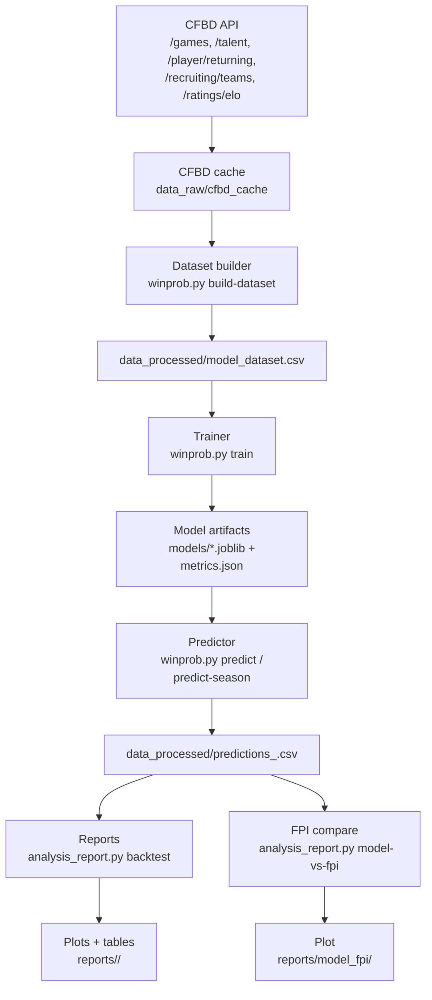
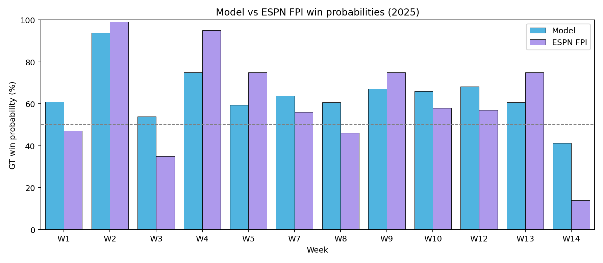

# Georgia Tech Football Win Probability Model (CFBD)

Train a Georgia Tech win-probability model from CollegeFootballData (CFBD) API data (games, Elo, talent, returning production, recruiting) without using CFBD's built-in win expectancy.

## What it does

- Builds a supervised dataset from CFBD game results + pregame features
- Trains a logistic regression win-probability model with recency weighting
- Calibrates predicted probabilities (auto-selects sigmoid vs isotonic by validation Brier score)
- Predicts a single matchup or an entire season schedule
- (Optional) Generates reports/plots and compares vs ESPN FPI

## Why this matters

Win probability models turn “how good are we?” into a calibrated, game-by-game number you can compare across seasons and opponents. That’s useful for:

- Setting realistic expectations (and spotting true upsets vs “coin-flips”)
- Quantifying disagreement vs public baselines (like ESPN FPI) to see where your model adds value
- Creating repeatable backtests with proper scoring rules (Brier / log loss), not just W/L picks

## Approach

This project frames win probability as a supervised classification problem: historical outcomes are paired with pregame team-strength indicators (team form, opponent strength, roster/talent proxies, and location). A simple model is used for transparency, then probabilities are calibrated so “70%” predictions behave like 70% over time.

## Pipeline (one-line)

CFBD API → feature engineering → dataset → logistic regression → calibration → evaluation → predictions + reports

## Architecture (high level)



## Features

- End-to-end CLI: build dataset → train → predict
- Recency weighting (half-life) so newer seasons matter more
- Probability calibration (sigmoid vs isotonic) with validation-based selection
- Reproducible metrics saved to `models/metrics.json`
- Caching of CFBD responses for faster reruns
- Optional reporting + plots and comparisons vs ESPN FPI

## Model features used

The model uses pregame, team-level features including:

- Home/away/neutral indicators
- Season-to-date team form (win%, point differential, schedule strength; plus recency-weighted versions)
- Elo differential (when available via CFBD)
- Roster strength proxies: talent composite, returning production, recruiting strength/rank (when available via CFBD)

## Requirements

- Python 3.10+
- A CFBD API key (set via `CFBD_API_KEY`)

Install dependencies:

`pip install -r requirements.txt`

## Sample output

Example `predict` output (fields may vary slightly depending on model target/calibration):

```json
{
  "team": "Georgia Tech",
  "opponent": "Florida State",
  "year": 2025,
  "week": 1,
  "p_win": 0.57,
  "model_target": "win",
  "p_win_raw": 0.55,
  "calibrator": "sigmoid_logit"
}
```

## Quickstart (PowerShell)

1) Set your CFBD API key (don't commit it):

`$env:CFBD_API_KEY="YOUR_KEY_HERE"`

2) Build the dataset and train:

`python .\winprob.py build-dataset --from-year 2014 --to-year 2025 --team "Georgia Tech"`

`python .\winprob.py train`

Outputs:

- `data_processed/model_dataset.csv`
- `models/gt_winprob_logreg.joblib`
- `models/gt_winprob_calibrator.joblib` (when calibration is selected)
- `models/feature_columns.json`
- `models/metrics.json`

3) Predict a matchup:

`python .\winprob.py predict --year 2025 --week 1 --opponent "Florida State" --home away`

`predict` prints `p_win` plus diagnostics like `p_win_raw` and the selected `calibrator`.

## Results (example run)

The repo includes example trained artifacts under `models/`. For that run:

- Train: 2014-2022, Validation: 2023-2024, Test: 2025
- Recency weighting half-life: 3.0 years
- Calibration selected: sigmoid (logit-space)
- Test (calibrated): accuracy 0.833, Brier 0.174, log loss 0.526

Full details: `models/metrics.json`.

Interpretation: Brier/log loss reward well-calibrated probabilities, so improvements here are a stronger signal than raw pick accuracy alone.

Note: the year split is currently fixed in code inside `winprob.py` (train=2014-2022, val=2023-2024, test=2025).

## Model vs ESPN FPI (win %)

This repo includes a comparison plot between this model's win probabilities and ESPN FPI win probabilities for each 2025 game:



To reproduce:

1) Generate a backtest CSV for the season:

`python .\analysis_report.py backtest --year 2025`

2) Generate the model-vs-FPI plot:

`python .\analysis_report.py model-vs-fpi --year 2025 --fpi .\data_processed\fpi_probs_2025_espn.csv`

The FPI inputs live in `data_processed/fpi_probs_2025_espn.csv` (GT win% by week). That file is a manually collected snapshot; update it if you want a different year/team/source.

## Predict an entire season schedule

This pulls the CFBD schedule (`/games`) and writes a CSV of per-game predictions:

`python .\winprob.py predict-season --year 2026 --team "Georgia Tech"`

Default output:

- `data_processed/predictions_2026.csv`

## Notes

- CFBD responses are cached under `data_raw/cfbd_cache/` to speed up repeated runs.
- CFBD requires an API key and may enforce rate limits; caching helps reduce repeated calls.
- This is a personal/educational model and is not affiliated with CFBD or Georgia Tech.

## Limitations

- The train/val/test split is currently hard-coded (see note above), so it’s not a full rolling backtest yet.
- CFBD endpoints can change or be missing depending on access/plan; the pipeline drops features that are entirely missing.
- Small sample sizes (single team, single season test) make metrics noisy; calibration can overfit when data is limited.
- FPI inputs in this repo are a manual snapshot for 2025 and are not fetched automatically.
- The model is pregame/team-level only (no in-game dynamics, injuries, weather, or play-by-play context).
- Logistic regression is intentionally simple and may miss nonlinear interactions.

## Future improvements

- Add a rolling / walk-forward evaluation mode across many seasons
- Add hyperparameter tuning and richer models (GBMs) while keeping calibration
- Support any team as a first-class target (not just GT) and add multi-team training
- Improve opponent strength features and injury/availability features (if data sources are available)
- Automate FPI ingestion (or support multiple external baselines) with clear provenance
