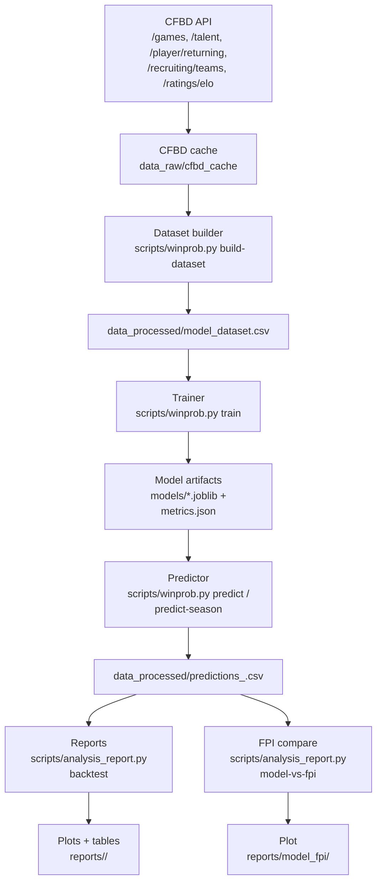
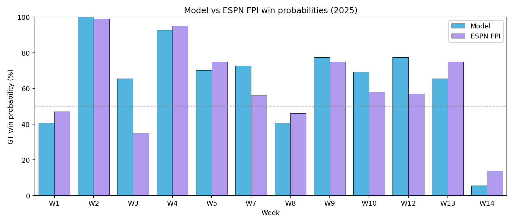

# Georgia Tech Football Win Probability Model (CFBD)

Train a Georgia Tech win-probability model from CollegeFootballData (CFBD) API data (games, Elo, talent, returning production, recruiting) without using CFBD's built-in win expectancy.

## What it does

- Builds a supervised dataset from CFBD game results + pregame features, either for one team's schedule or pooled across every FBS team
- Trains a logistic regression win-probability model with recency weighting
- Calibrates predicted probabilities (auto-selects sigmoid vs isotonic by validation Brier score)
- Predicts a single matchup or an entire season schedule
- Evaluates with a rolling walk-forward backtest across many seasons, not just one fixed test year
- (Optional) Generates reports/plots and compares vs ESPN FPI

## Why this matters

Win probability models turn “how good are we?” into a calibrated, game-by-game number you can compare across seasons and opponents. That’s useful for:

- Setting realistic expectations (and spotting true upsets vs “coin-flips”)
- Quantifying disagreement vs public baselines (like ESPN FPI) to see where your model adds value
- Creating repeatable backtests with proper scoring rules (Brier / log loss), not just W/L picks

## Approach

This project frames win probability as a supervised classification problem: historical outcomes are paired with pregame team-strength indicators (team form, opponent strength, roster/talent proxies, and location). A simple model is used for transparency, then probabilities are calibrated so “70%” predictions behave like 70% over time.

## Pipeline (one-line)

CFBD API → feature engineering → dataset → logistic regression → calibration → evaluation → predictions + reports

## Architecture (high level)


```mermaid
flowchart TD
  A[CFBD API\n/games, /talent, /player/returning,\n/recruiting/teams, /ratings/elo] --> B[CFBD cache\n data_raw/cfbd_cache]
  B --> C[Dataset builder\n scripts/winprob.py build-dataset]
  C --> D[data_processed/model_dataset.csv]
  D --> E[Trainer\n scripts/winprob.py train]
  E --> F[Model artifacts\n models/*.joblib + metrics.json]
  F --> G[Predictor\n scripts/winprob.py predict / predict-season]
  G --> H[data_processed/predictions_<year>.csv]
  H --> I[Reports\n scripts/analysis_report.py backtest]
  I --> J[Plots + tables\n reports/<year>/]
  H --> K[FPI compare\n scripts/analysis_report.py model-vs-fpi]
  K --> L[Plot\n reports/model_fpi/]
```

## Code layout

- `scripts/winprob.py` - thin CLI entry point (argparse only); this is what you run
- `src/winprob_lib/` - the implementation, split by concern:
  - `cfbd_client.py` - `CFBDClient` (caching HTTP client) and team-name resolution
  - `features.py` - dataset builders (`build_dataset`, `build_dataset_all_fbs`) and the pregame feature-engineering functions they share
  - `train.py` - model fitting, calibration selection, `train_model`, `walk_forward_eval`, `compute_feature_importance`, `ablation_study`
  - `predict.py` - live feature fetch + prediction for a single matchup or a season schedule
- `scripts/analysis_report.py`, `scripts/market_compare.py` - downstream reporting/backtesting, unchanged; `market_compare.py` imports `CFBDClient`/`resolve_team_name` from `scripts/winprob.py`, which re-exports them from `winprob_lib`

## Features

- End-to-end CLI: build dataset → train → predict
- Recency weighting (half-life) so newer seasons matter more
- Probability calibration (sigmoid vs isotonic) with validation-based selection
- Reproducible metrics saved to `models/metrics.json`
- Caching of CFBD responses for faster reruns
- Optional reporting + plots and comparisons vs ESPN FPI
- Feature importance (standardized coefficients) and cumulative feature-group ablation, both built on the walk-forward methodology

## Model features used

The model uses pregame, team-level features including:

- Home/away/neutral indicators
- Season-to-date team form (win%, point differential, schedule strength; plus recency-weighted versions)
- Elo differential (when available via CFBD)
- Roster strength proxies: talent composite, returning production, recruiting strength/rank (when available via CFBD)

## Requirements

- Python 3.10+
- A CFBD API key (set via `CFBD_API_KEY`)

Install dependencies:

`pip install -r requirements.txt`

## Sample output

Example `predict` output (fields may vary slightly depending on model target/calibration):

```json
{
  "team": "Georgia Tech",
  "opponent": "Florida State",
  "year": 2025,
  "week": 1,
  "p_win": 0.57,
  "model_target": "win",
  "p_win_raw": 0.55,
  "calibrator": "sigmoid_logit"
}
```

## Quickstart (PowerShell)

1) Set your CFBD API key (don't commit it):

`$env:CFBD_API_KEY="YOUR_KEY_HERE"`

2) Build the dataset and train:

`python .\scripts\winprob.py build-dataset --from-year 2014 --to-year 2025 --team "Georgia Tech"`

`python .\scripts\winprob.py train`

Outputs:

- `data_processed/model_dataset.csv`
- `models/gt_winprob_logreg.joblib`
- `models/gt_winprob_calibrator.joblib` (when calibration is selected)
- `models/feature_columns.json`
- `models/metrics.json`

**Pooled training (recommended):** one team's history is only ~150 games across 12 seasons - too
few to fit or calibrate a stable model. `--scope all-fbs` pools every FBS team's games (both
home/away perspective) into one team-agnostic training set, using the exact same relative
team-strength-diff features, so it's still a Georgia Tech predictor - just trained on ~20,000
games instead of ~150:

`python .\scripts\winprob.py build-dataset --scope all-fbs --from-year 2014 --to-year 2025 --out data_processed\model_dataset_all_fbs.csv`

`python .\scripts\winprob.py train --dataset data_processed\model_dataset_all_fbs.csv`

This is a bigger download than `--scope team` but still cheap: `/games` is fetched once per year
league-wide instead of once per team, so it's fewer CFBD requests, not more (roughly a minute for
2014-2025 uncached).

3) Predict a matchup:

`python .\scripts\winprob.py predict --year 2025 --week 1 --opponent "Florida State" --home away`

`predict` prints `p_win` plus diagnostics like `p_win_raw` and the selected `calibrator`.

## Results (example run)

The repo includes example trained artifacts under `models/`, trained on the pooled all-FBS
dataset (see Quickstart). For that run:

- Train: 2014-2022, Validation: 2023-2024, Test: 2025 (league-wide, ~17,700 train rows)
- Recency weighting half-life: 3.0 years
- Calibration selected: isotonic
- Test (league-wide, calibrated): accuracy 0.731, Brier 0.176, log loss 0.574
- Test (league-wide, raw/uncalibrated): accuracy 0.736, Brier 0.175, log loss 0.519

Full details: `models/metrics.json`.

Note the raw (uncalibrated) log loss is actually *better* than the calibrated one here - the
auto-selected calibrator (chosen by validation Brier score alone) buys very little accuracy/Brier
and costs some log loss. Worth a second look if you're optimizing log loss specifically;
`--calibration none` skips it entirely.

Interpretation: Brier/log loss reward well-calibrated probabilities, so improvements here are a stronger signal than raw pick accuracy alone.

Note: the deployed model's year split is still fixed in code inside `scripts/winprob.py`
(train=2014-2022, val=2023-2024, test=2025) - see **Walk-forward evaluation** below for a
methodology that doesn't depend on one fixed test year.

## Walk-forward evaluation

A single fixed test year is 12-13 Georgia Tech games - too few and too noisy to trust a Brier or
log-loss number on its own. `scripts/winprob.py walkforward` retrains per season instead: for
test year Y it trains on years < Y-1, calibrates on year Y-1, predicts year Y, then pools every
year's held-out predictions into one set of metrics.

`python .\scripts\winprob.py walkforward --dataset data_processed\model_dataset.csv --start-test-year 2019`

Rolling 2019-2025 (85 held-out Georgia Tech games across 7 seasons), comparing a GT-only model
against the pooled all-FBS model (evaluated on GT's games specifically, via `--eval-team`):

| | Accuracy (raw) | Brier (raw) | Accuracy (calibrated) | Brier (calibrated) |
|---|---|---|---|---|
| GT-only training | 0.447 | 0.339 | 0.529 | 0.300 |
| Pooled all-FBS training | 0.706 | 0.218 | 0.659 | 0.216 |

`python .\scripts\winprob.py walkforward --dataset data_processed\model_dataset_all_fbs.csv --eval-team "Georgia Tech" --start-test-year 2019`

Pooling helps by an even wider margin than it first looked - unsurprising, since ~150 rows isn't
enough for a logistic regression to find stable weights, and now that all 20 features (see the
`talent`/`returning` bug fix below) actually carry signal, GT-only's tiny sample has even more
parameters to estimate from the same 148 rows, making it overfit worse than before. One caveat
worth flagging: calibrated log loss was *worse* than raw log loss for GT-only above (isotonic
calibration fit on a single season - or even the whole league in a season - can still snap to a
hard 0/1 in some probability range, which is catastrophic for log loss the one time it's wrong).
Selecting the calibrator by validation Brier alone doesn't protect against that; see Future
improvements.

### Does older history actually help?

Recency weighting (3-year half-life) already discounts old seasons, but college football had real
regime shifts in this window - the transfer portal (~2018+) changed how rosters get built, NIL
(2021+), and heavy conference realignment. To check whether the decay alone was enough, walk-forward
was run twice over the identical 63 held-out GT games (2021-2025), varying only how far back the
training pool goes:

| Training pool | Accuracy (calibrated) | Brier (calibrated) | Log loss (calibrated) | ECE |
|---|---|---|---|---|
| Full 2014-2025 | 0.635 | 0.216 | 0.612 | 0.149 |
| 2018-2025 only | 0.635 | **0.213** | **0.604** | **0.143** |

2018+-only still wins on Brier/log loss/ECE, but the gap is now small - both training pools land
on identical accuracy. An earlier run of this same comparison (before the `talent`/`returning`
field-name bug below was found and fixed) showed a much larger gap (0.619 vs 0.651 accuracy).
With those two features actually working now, most of that earlier gap closed - a good reminder
that a "the data doesn't transfer across eras" conclusion can really be "two of your features were
silently broken the whole time," and it's worth re-checking findings after a real bug fix rather
than assuming they still hold. The remaining small edge for 2018+ is still a real, consistent
signal, just a much less dramatic one than first measured.

## Feature importance

Every feature is standardized (mean 0, std 1) before fitting, so the logistic regression's raw
coefficients are already directly comparable - each one is the effect on the log-odds of a
one-standard-deviation change in that feature.

`python .\scripts\winprob.py feature-importance --model models\gt_winprob_logreg.joblib`

Top features by |coefficient|, from the current deployed (pooled all-FBS) model:

| feature | coefficient (per SD) | odds ratio (per SD) |
|---|---|---|
| `elo_diff` | 0.861 | 2.37 |
| `opp_elo_avg_diff` | 0.515 | 1.67 |
| `w_opp_elo_avg_diff` | -0.458 | 0.69 |
| `is_home` | 0.310 | 1.36 |
| `talent_diff` | 0.245 | 1.28 |
| `returning_diff` | 0.208 | 1.23 |

Elo differential dominates by a wide margin - unsurprising, since it's the single most
information-dense feature (it already summarizes a team's whole résumé into one number).
Full ranking of all 20 features: `reports/feature_importance.csv`.

## Ablation study

Cumulative feature-group ablation: start from location/context alone, add one data source at a
time (Elo, season-to-date form, talent, returning production, recruiting), and re-run
`walk_forward_eval()` on each cumulative subset over the identical test years - so differences
between rows are attributable to the group just added, not evaluation noise.

`python .\scripts\winprob.py ablation --dataset data_processed\model_dataset_all_fbs.csv --eval-team "Georgia Tech" --start-test-year 2019`

| Added group | Accuracy (raw) | Brier (raw) | Accuracy (calibrated) | Brier (calibrated) |
|---|---|---|---|---|
| context (home/away/neutral, opp FBS) | 0.529 | 0.247 | 0.529 | 0.247 |
| + elo | 0.647 | 0.219 | 0.635 | 0.211 |
| + form | 0.659 | 0.219 | 0.694 | 0.213 |
| + talent | 0.635 | 0.223 | 0.659 | 0.222 |
| + returning production | 0.682 | 0.217 | 0.694 | 0.215 |
| + recruiting (full feature set) | 0.706 | 0.218 | 0.659 | 0.216 |

Elo alone jumps accuracy from a near-coin-flip (0.529) to 0.647 - by far the single biggest
contribution, consistent with the coefficient ranking above. `talent`'s marginal contribution on
top of `form` is small and noisy on this 85-game sample (it can even look like a step backward,
which is plausibly just noise combined with `talent_diff` correlating with `recruit_points_diff`
and `elo_diff` - roster talent, recruiting rank, and results all measure overlapping things).
Full per-step results (predictions, val Brier per fold): `reports/ablation/`.

### A bug this surfaced

Building the feature-importance table above is what caught this: `talent_diff` and
`returning_diff` were **entirely missing** (0 non-null out of ~19,500 rows) in every dataset this
project had ever built. Two silent bugs, both field-name mismatches against CFBD's actual
response schema:

- `/talent` responses use `"team"` as the school-name key, not `"school"` (the code was written
  assuming the same key name `/teams` uses) - so the lookup index was always empty.
- `/player/returning` responses use `"totalPPA"` (that exact casing), not `"totalPpa"` - so the
  fallback chain in `_returning_total()` never matched and always fell through to `None`.

Both are fixed in `cfbd_client.py`/`features.py`/`predict.py`. Rebuilding after the fix: `talent_diff`
went from 0 to 17,782 populated rows (of 19,456), `returning_diff` from 0 to 17,846. Walk-forward
accuracy on GT's games rose from 0.635 to 0.706 (raw) as a direct result - these two features had
never actually contributed to any result in this README before this fix, despite being described
as part of the model the whole time.

## Model vs ESPN FPI (win %)

This repo includes a comparison plot between this model's win probabilities and ESPN FPI win probabilities for each 2025 game:



To reproduce:

1) Generate a backtest CSV for the season:

`python .\scripts\analysis_report.py backtest --year 2025`

2) Generate the model-vs-FPI plot:

`python .\scripts\analysis_report.py model-vs-fpi --year 2025 --fpi .\data_processed\fpi_probs_2025_espn.csv`

The FPI inputs live in `data_processed/fpi_probs_2025_espn.csv` (GT win% by week). That file is a manually collected snapshot; update it if you want a different year/team/source.

## Predict an entire season schedule

This pulls the CFBD schedule (`/games`) and writes a CSV of per-game predictions:

`python .\scripts\winprob.py predict-season --year 2026 --team "Georgia Tech"`

Default output:

- `data_processed/predictions_2026.csv`

## Notes

- CFBD responses are cached under `data_raw/cfbd_cache/` to speed up repeated runs.
- CFBD requires an API key and may enforce rate limits; caching helps reduce repeated calls.
- This is a personal/educational model and is not affiliated with CFBD or Georgia Tech.
- Team FBS/FCS classification is fetched per-year (`/teams?year=Y`), not as a single present-day snapshot - several teams moved FCS->FBS during 2014-2025 (e.g. Jacksonville State in 2023), and a present-day-only lookup would mislabel their older games.
- Elo differential has a preseason fallback: if CFBD hasn't published any current-season Elo yet (true for the entire off-season/very early in a season - e.g. `/ratings/elo` and embedded pregame Elo are both empty for 2026 as of this writing), each team's prior-season-final Elo is regressed toward the mean (`ELO_CARRYOVER_SLOPE`/`ELO_CARRYOVER_INTERCEPT` in `features.py`, fit by linear regression against 1,433 historical team-seasons, R^2 = 0.97) and used instead of leaving `elo_diff` missing.

## Limitations

- The *deployed* model's train/val/test split is still hard-coded (see note above); `walkforward` avoids this for evaluation, but `train` itself always uses one fixed split.
- CFBD endpoints can change or be missing depending on access/plan; the pipeline drops features that are entirely missing.
- Calibration is selected by validation Brier score alone, which can pick a calibrator that quietly hurts log loss (see Walk-forward evaluation) - there's no safeguard against isotonic snapping to a hard 0/1 in a thin probability bin.
- FPI inputs in this repo are a manual snapshot for 2025 and are not fetched automatically.
- The model is pregame/team-level only (no in-game dynamics, injuries, weather, or play-by-play context).
- Logistic regression is intentionally simple and may miss nonlinear interactions.

## Future improvements

- Make the deployed model's `train` split walk-forward too (right now only evaluation is rolling; the shipped artifact still comes from one fixed split)
- Select the calibrator by a blend of Brier and log loss (or clip isotonic away from exact 0/1) instead of Brier alone
- Add hyperparameter tuning and richer models (GBMs) while keeping calibration
- Improve opponent strength features and injury/availability features (if data sources are available)
- Automate FPI ingestion (or support multiple external baselines) with clear provenance
